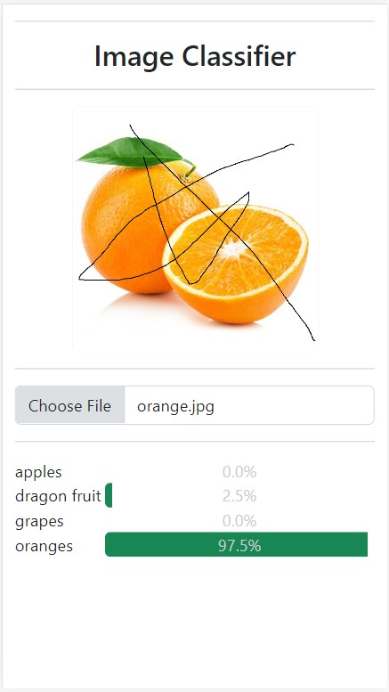

# Convolutional Neural Network (CNN) Using Keras with Web App
You can try a demo at http://129.146.130.43/cnn_keras/.

## Install Required Libraries
 * Run the command `pip install -r requirements.txt`

## Retrain the Model With New Images
 * In the folder `train`, there are folders of the classes of which to be classified. Each folder contains images of each class (example, `apples` folder contains images of apples).
 * The images must all be JPG.
 * After putting all images, run the command `python train.py`. After training, it will save a model that can be used later on for testing.

## Test the Model
* In the file `test.py` at line 13, there is the image of the file that will be tested. This file can be replaced with an image on the internet. Again, all images must be JPG.
* To test, run the command `python test.py`.

## Deploying to a XAMPP for Windows
* Download XAMPP.
* Move or copy the entire project directory to `C:\xampp\htdocs\cnn_keras`.
* Make sure Apache service of XAMPP is running.
* Then in the browser, open `http://localhost/cnn_keras`.

## (Optional) Deploying to a Web Server
* After training and testing the model, move the entire project directory to a web server such as Amazon EC2 or Digital Ocean Droplet.
